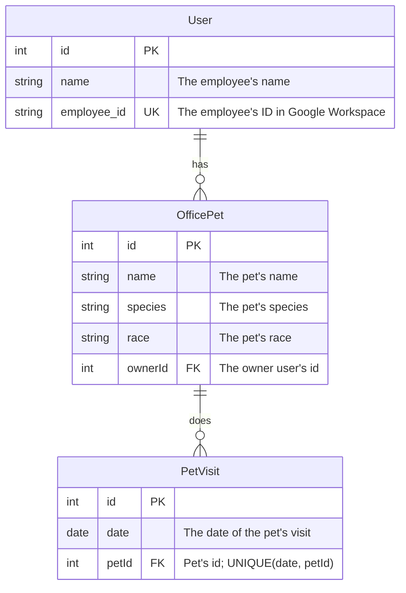

# profiq reference app

## Basic setup

### Getting started

To get started, first clone this repository and enter it

```shell
git clone git@gitlab.com:profiq/all/infra/profiq-reference-app.git profiq-reference-app
cd profiq-reference-app
```

Then, run the following command inside the project root directory

```shell
npm install
```

Then, you need to create `.env`. Refer to the [`.env.example`](.env.example) file or to the [Environment variables](#environment-variables) section of README for the structure of this file.

Afterwards, if you do not want to use the emulator instead of the cloud, run

```shell
npm run firebase:emulator -w frontend
```

Now, you can start the frontend

```shell
npm run dev:frontend
```

and the backend

```shell
npm run dev:backend
```

### Structure

The project is divided into two packages in the following directories

```
.
├── frontend/
└── backend/
```

### Environment variables

You need to define the following variables in the .env file located in the root directory of the project:

#### Frontend env

Due to frontend being built using [vite](https://vite.dev/), we need to prefix the environment variables meant for frontend usage with `VITE_`. For more information about why this is the case, refer to the documentation: [Vite Guide - Env Variables and Modes](https://vite.dev/guide/env-and-mode)

##### Firebase

The following environmental variables can be obtained from firebase project admin console

```
VITE_FIREBASE_API_KEY=
VITE_FIREBASE_AUTH_DOMAIN=
VITE_FIREBASE_PROJECT_ID=
VITE_FIREBASE_STORAGE_BUCKET=
VITE_FIREBASE_MESSAGING_SENDER_ID=
VITE_FIREBASE_APP_ID=
VITE_FIREBASE_MEASUREMENT_ID=
```

You can also use [emulator](https://firebase.google.com/docs/emulator-suite) instead of running on the cloud

```
VITE_FIREBASE_EMULATE=            # 'true' or 'false'
VITE_FIREBASE_EMULATOR_URL=       # URL of the emulator obtained during emulator startup, e.g. http://localhost:9099
```

##### Other frontend env

URL of the backend service

```
VITE_API_URL=
```

#### Backend env

Project id of firebase

```
FIREBASE_PROJECT_ID=
```

the client email of google service account

```
GOOGLE_CLIENT_EMAIL=
```

Environment variable with the private key of the service account

```
GOOGLE_PRIVATE_KEY=
```

An optional env variable allowing to specify the port

```
PORT=
```

To use images, you need to specify the bucket name with

```
GOOGLE_STORAGE_BUCKET=
```

You can use storage emulator for local dev using env variable. The emulator can be started with `npm run -w backend firebase:emulator:storage`

```
FIREBASE_STORAGE_EMULATOR_HOST=
```

## Testing

### Frontend

Frontend contains unit and component tests written using vitest. Component tests use playwright as the backend.

Unit tests have file name format `{tested-part}.unit-spec.ts`. Component tests have name format `{tested-part}.component-spec.ts`.

To test the frontend, run the following commands from the project root

```shell
npn run init:playwright -w frontend
npm run test -w frontend
```

Both unit and component tests are run using this command.

### Backend

Backend contains unit and e2e tests written using jest. E2E tests use Supertest to simulate HTTP and Google Local Emulator Suite for auth.

Unit tests have file name format `{tested-part}.spec.ts` and are located next to the tested file. E2E tests have file name format of `{tested-part}.e2e-spec.ts` and are located in the `test/` directory.

To test the backend, run the following commands from the project root

```shell
npm run test -w backend
npm run test:e2e-emulator -w backend
```

The first runs the unit tests and the second runs the e2e tests.

---

# Architecture

There are four components in the architecture of the project:

- FE - React SPA
- BE - NestJS + SQL-based DB
- CI / CD - GitLab CI pipelines
- Google Cloud deployment - one project for dev, one for prod

All the secrets are kept in environment variables loaded from `.env` file in the root on startup.

---

# Tech Stack

## Global

- [Node.js](https://nodejs.org/en) - JavaScript runtime for servers and CLI.
- [npm](https://docs.npmjs.com/) - Node.js default package manager.
- [TypeScript](https://www.typescriptlang.org/) - JavaScript with added type safety and checking.
- [Prettier](https://prettier.io/docs/) - JavaScript formatter.
- [ESLint](https://eslint.org/docs/latest/) - A JavaScript linter.
- [Husky](https://typicode.github.io/husky/) - A git hook software ensuring both prettier and ESLint run and pass before any commit.

## Frontend

- [React SPA (Single page application)](https://react.dev/reference/react) - A JavaScript library allowing for state sync, context and rendering.
- [Vite](https://vite.dev/guide/) - Node.js build tool for setup and buiding of the resulting file.
- [ShadCN](https://ui.shadcn.com/docs) - React library for reusable components.
- [Vitest](https://vitest.dev/guide/) - Testing library for unit and component tests.
- [Tailwind](https://tailwindcss.com/docs/styling-with-utility-classes) - We Tailwind for styling.
- [Tanstack Query](https://tanstack.com/query/latest/docs/framework/react/overview) - Backend data fetching and caching library.
- [React Router](https://reactrouter.com/start/declarative/routing) - React library for routing. We use declarative mode.
- [Firebase](https://firebase.google.com/docs/auth) - For getting the auth token using Google OAuth2.

## Backend

- [NestJS](https://docs.nestjs.com/) - Node.js web framework. We use Express as the backend.
- [OpenAPI](https://swagger.io/specification/) - Rest API specification, used to define and specify each endpoint and its response using a JSON schema.
- [Swagger UI](https://swagger.io/docs/) - Helps us vizualize and send out requests to the backend according to the OpenAPI specification.
- [TypeORM](https://docs.nestjs.com/techniques/database) or [here](https://typeorm.io/docs/getting-started/) - An ORM system with first-class support from NestJS.
- Database - We use an SQL database.
  - [SQLite](https://www.sqlite.org/) - For development; a local embedded (single-file/in-memory) database.
  - [PostgreSQl](https://www.postgresql.org/) - For production; a highly scalable client-server RDBMS.
- [Jest](https://jestjs.io/docs/getting-started) - Testing library for Node.js.
- [Supertest](https://www.npmjs.com/package/supertest) - Library for simulating HTTP requests and testing HTTP responses. Used in E2E tests.
- [Google Local Emulator Suite](https://firebase.google.com/docs/emulator-suite) - For creating emulated accounts during e2e testing.
- [Firebase Admin SDK](https://firebase.google.com/docs/reference/admin) - Allows validation of JWT tokens signed by Google.
- [Google Workspace API](https://developers.google.com/workspace) - For obtaining the employee data.

## CI/CD, Deployment

- GitLab CI - for CI/CD we use GitLab's native `.gitlab-ci.yml`.
- Firebase Hosting - for hosting the frontend, we use Google's Firebase Hosting
- ... - for hosting the backend, we use ...

---

# CI/CD

## GitLab CI

For CI/CD purposes we use GitLab CI using `.gitlab-ci.yml`.

## Defaults

We use the following defaults:

```yaml
default:
  image: node:22.21.1
  tags:
    - profiq
#  # cache is disabled due to slowdown it causes in this small pipeline
#  # but on bigger projects, it can be beneficial to enable. The way to enable
#  # it can be found in the comments
#  cache: &default_cache
#    key:
#      files:
#        - 'package-lock.json'
#        - '**/package.json'
#    paths:
#      - .npm
#    policy: pull
```

- `image` - default OCI (/Docker) image
- `tags` - run jobs on profiq runners
- `cache` - commented out due to low performance, uses zip and download/upload
- `&default_cache` - [YAML anchor](https://docs.gitlab.com/ci/yaml/yaml_optimization/#anchors), allows part to be used elsewhere with merge

## Globals

```yaml
stages:
  - code_quality
  - test

variables:
  GIT_DEPTH: 1
```

- `stages` - specify order, run sequentially, jobs in one stage run in parallel
- `GIT_DEPTH` - how many commits should the runner clone

## Reusable blocks

```yaml
.set_npm_config:
  before_script:
    - npm config set cache .npm
    - npm config set prefer-offline true

.rule_mr_and_main:
  rules:
    - if: $CI_PIPELINE_SOURCE == "merge_request_event"
    - if: $CI_COMMIT_BRANCH == "main"

.npm_ci_only_root:
  before_script:
    - !reference [.set_npm_config, before_script]
    - npm ci --workspaces=false

.npm_ci_frontend:
  before_script:
    - !reference [.set_npm_config, before_script]
    - npm ci -w frontend --include-workspace-root

.npm_ci_backend:
  before_script:
    - !reference [.set_npm_config, before_script]
    - npm ci -w backend --include-workspace-root
```

This part specifies multiple blocks that are used elsewhere using extends, so that their change happens in only one place instead of in multiple spaces. `!reference` allows to reference a part of another block and merge it instead of overwriting it.

## Code Quality

```yaml
code_quality:
  stage: code_quality
  extends:
    - .rule_mr_and_main
    - .npm_ci_only_root
  script:
    - npm run lint:eslint
    - npm run lint:prettier
```

This job ensures code quality. As it extends `.rule_mr_and_main` and `.npm_ci_only_root`, it inherits their properties. After resolving it would look like the following code

```yaml
code_quality:
  stage: code_quality
  rules:
    - if: $CI_PIPELINE_SOURCE == "merge_request_event"
    - if: $CI_COMMIT_BRANCH == "main"
  before_script:
    - npm config set cache .npm
    - npm config set prefer-offline true
    - npm ci --workspaces=false
  script:
    - npm run lint:eslint
    - npm run lint:prettier
```

## Tests

```yaml
frontend-test:
  stage: test
  extends:
    - .rule_mr_and_main
    - .npm_ci_frontend
  script:
    - !reference [.npm_ci_frontend, before_script]
    # if unit tests fail, there is no reason to waste time installing playwright
    # so run it first
    - npm run test:unit -w frontend
    - npm run init:playwright -w frontend
    - npm run test:component -w frontend

backend-unit:
  stage: test
  extends:
    - .rule_mr_and_main
    - .npm_ci_backend
  script:
    - npm run test -w backend

backend-e2e:
  stage: test
  extends:
    - .rule_mr_and_main
    - .npm_ci_backend
  script:
    - npm run test:e2e-emulator -w backend
```

All the tests are in the same stage, so they run in parallel, thus ensuring higher performance. As you can see, `!reference` can be used directly in the script.

TODO: add a diagram

---

# Integrations

## Auth

- For authentication we used [Firebase Auth](https://firebase.google.com/docs/auth)
- We obtain a JWT token signed by google, and add it to the headers of requests sent out to the backend
- Implementation:
  - [backend/src/auth/auth.guard.ts](backend/src/auth/auth.guard.ts)
  - [frontend/src/lib/providers/auth/AuthProvider.tsx](frontend/src/lib/providers/auth/AuthProvider.tsx)
  - [frontend/src/lib/api_client/api_client.ts](frontend/src/lib/api_client/api_client.ts)

## Google Workspace Api

- We use Google Workspace API to get list of a employees and to get information about a specific employee of the company.
- For security, we use a service account with delegation and read-only permissions for the [users methods](https://developers.google.com/workspace/admin/directory/reference/rest/v1/users).
- Implementation:
  - [backend/src/employee/employee.service.ts](backend/src/employee/employee.service.ts)
- For general information about integration in projects, see the [Infrastructure wiki](https://gitlab.com/profiq/all/infra/infra/-/wikis/Integrations/Google-Workspace-Integration)

---

# Database diagram



---

## Goal

The goal of this project is to build a reference project & architecture for all our future project. Meaning we want to have everything in this project correct.
And it will be inspiration for all the future projects.

There will be 4 main components of this project:

- FE (React SPA)
- BE (NestJS with SQL based DB)
- CI / CD (Gitlab CI pipelines ) & git management
- Deployment on Google Cloud (development & production)

### Setup

- Monorepo with 2 packages -- BE & FE
- npm with package version pinning

### FE

- React SPA (Single page app) with CSR (client side rendering) - (we don't want to use any server components etc)
  - VITE tooling
  - Unit tests for regular code
  - Unit tests for React code
- Typescript
- Code style
  - Prettier / eslint (added on git hooks)
- Libraries
  - React Router
    - With declarative mode https://reactrouter.com/start/declarative/routing
  - Tanstack query for API calls / caching
  - Few simple components with ShadCN + Tailwind for styling
- Authorization -- google firebase Authorization - allow only @profiq.com emails to login
- .env file for configuration
- Features:
  - Login to the app
  - Navigate to a different tab (routing example)
  - CRUD operations
- Deployment
  - Deployed to Firebase hosting
- Stretch goals:
  - e2e test automation with Playwright
  - Document testing of the app (test plan)

### BE

- NestJS with Typescript
- Rest API
  - Proper status codes / error handling / logging / HTTP methods
- Authorization middlware connected to the firebase auth
- Proper logging & tracing of requests (TBD logging)
- ORM (TBD)
- .env file for configuration

### CI / CD & Git management

#### Git flow

- main branch (we never push directly to the main branch)
  - we don't have any development branch or anything like that
- Features branches
  - For new things we create feature branches - and then we create merge request where CI runs

#### CI

- on PR we want to run all the tests
  - 1# Check prettier / eslint (even though it's in git hooks this needs to run in CI!!)
  - Run build
  - Run unit tests
  - run any e2e tests

- explore node modules caching
- tweaks to make CI as fast as possible
- think about the structure ( what run in parallel, what in sequence etc)

#### CD

- main branch is automatically deployed to development enviroment
- tags (v1.2.3) are deployed to production enviroment
